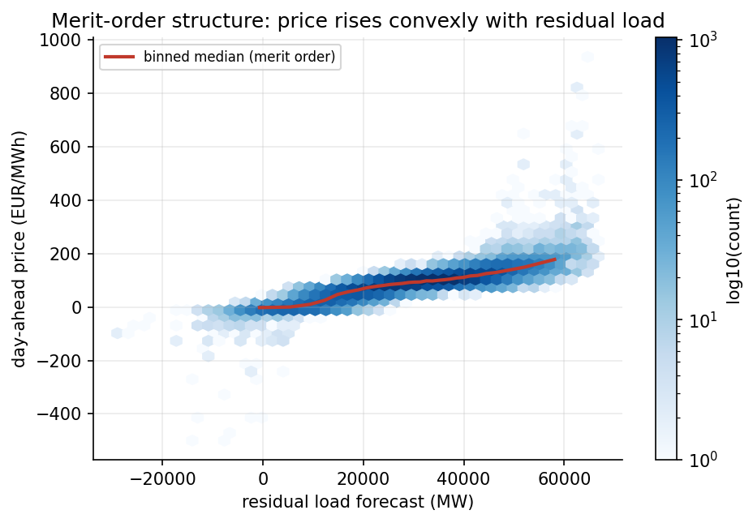
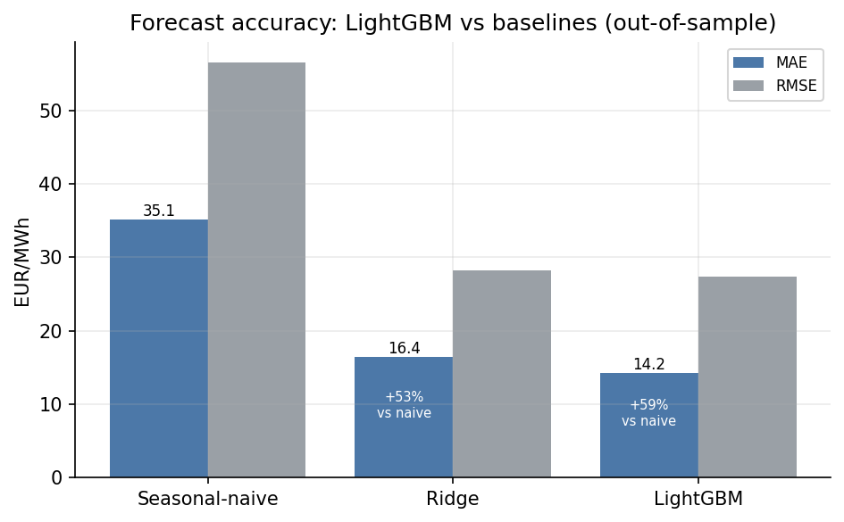
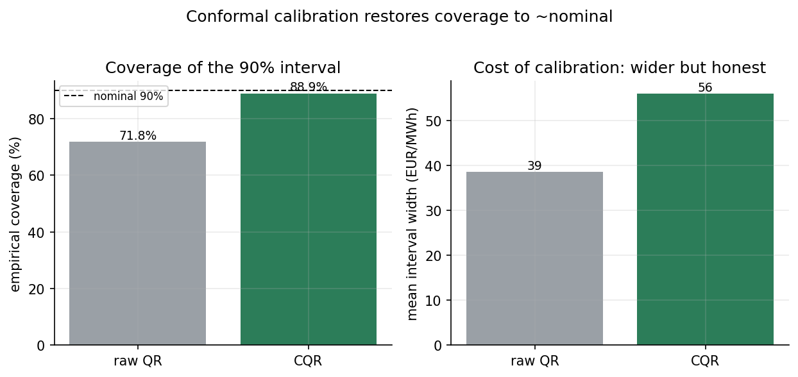
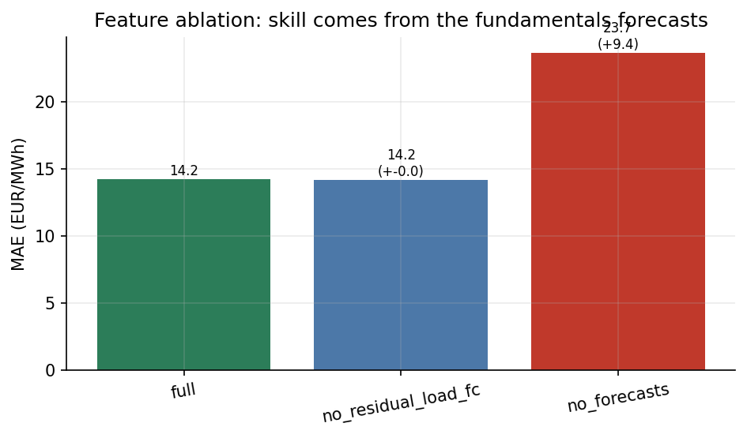
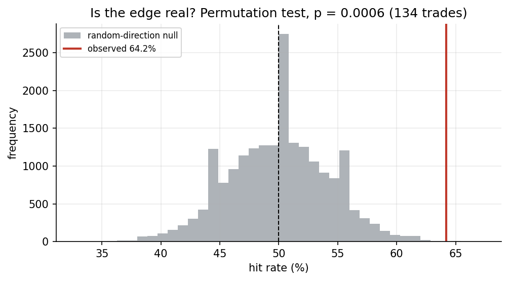

# Power Fair Value — German Day-Ahead Forecast & Prompt-Curve View

A daily fair-value model for German (DE/LU) day-ahead electricity prices, a
translation of that forecast into a tradable prompt-curve view, and a
programmatic LLM component — built to production standards with leakage-safe
validation and honest, falsifiable claims throughout.

**Author:** Pietro Cuoco

---

## What it does

1. **Data & QA** — pulls 12 [SMARD](https://www.smard.de) series (day-ahead
   price, load, wind/solar generation, and the corresponding day-ahead
   forecasts), validates them (timezone/DST, missing values, negative prices,
   spikes), and builds a clean hourly dataset.
2. **Forecasting** — a leakage-guarded, walk-forward-validated **LightGBM**
   model with **conformal** prediction intervals, benchmarked against
   seasonal-naive and Ridge baselines and tested for significance with the
   Diebold–Mariano test.
3. **Trading translation** — converts the hourly fair value into a daily
   baseload view and a falsifiable, cost-aware signal versus a forward proxy,
   with explicit invalidation rules tied to the model's own uncertainty.
4. **LLM component** — turns free-text outage/news into schema-validated
   structured supply-disruption features, with logging and graceful offline
   degradation.

## Headline results

Out-of-sample (16,729 hourly forecasts, expanding walk-forward, ~mid-2024 to
May 2026):

| Model | MAE (EUR/MWh) | RMSE (EUR/MWh) | Skill vs naive |
|---|---|---|---|
| Seasonal-naive | 35.13 | 56.54 | — |
| Ridge | 16.42 | 28.21 | +53.2% |
| **LightGBM** | **14.23** | **27.33** | **+59.5%** |

- LightGBM beats both baselines with **Diebold–Mariano** significance (vs naive
  +22.1, vs Ridge +10.1; p ≈ 0).
- **Conformal** calibration lifts 90% interval coverage from 71.8% to 88.9%.
- **Ablation**: removing all fundamentals forecasts costs +9.45 MAE — the skill
  is genuine fundamentals, not price autocorrelation.
- **Trading**: against a forward-looking consensus the signal hits 61.9%
  (≈2.7σ above chance) at +EUR 4.18/trade after costs; a confidence filter
  roughly doubles the risk-adjusted information ratio by standing down on
  uncertain days. This is a **mechanism demonstration, not deployable alpha**
  (see *Limitations*).

## Reproduce

Requires Python ≥ 3.11 and network access for the SMARD download.

```bash
make install     # install dependencies + the package (editable)
make run         # full pipeline: ingest -> qa -> features -> models ->
                 #   conformal -> analysis -> trade -> llm -> figures -> submission
make test        # 45 unit tests
make lint        # ruff
```

Windows (no `make`):

```powershell
pip install -r requirements.txt; pip install -e .
python scripts/run_pipeline.py --stage all
pytest -q; ruff check .
```

Optional: put `GEMINI_API_KEY` in `.env` to enable live LLM extraction — the
pipeline runs fully without it (the LLM stage degrades to zero events and the
tests use a mocked client).

## Figures


*Prices rise convexly with residual load — the economic structure that
motivates a nonlinear model.*


*LightGBM materially beats both baselines out-of-sample.*


*Conformal calibration restores the 90% interval from 71.8% to ~89% coverage,
at the honest cost of a wider band.*


*Removing the fundamentals forecasts collapses accuracy; the skill is real
fundamentals, not autocorrelation.*


*Permutation test: the 61.9% hit rate sits well right of the random-direction
null — a real but modest edge.*

## Repository structure

```
src/power_fv/        ingest, qa, features, validate, models, analysis, trade, llm, plots
scripts/run_pipeline.py   single CLI entrypoint (--stage ...)
tests/               45 unit tests incl. a leakage guard
config/config.yaml   market, walk-forward, quantiles, peak hours, llm settings
docs/logbook/        daily build logbook (days 1-4)
reports/figures/     the five figures above
submission.csv       hourly forecasts with calibrated 90% intervals
Makefile             one-command reproduction
```

## Methodology notes

- **No leakage:** every feature carries an information timestamp; a guard
  asserts that nothing used for delivery day *D* is known after the D-1 12:00
  Berlin gate. The guard runs both as a pipeline check and as unit tests.
- **Honest validation:** expanding-window walk-forward (no shuffling), DM tests
  for significance, conformal intervals for calibrated uncertainty, and an
  error breakdown by regime (normal / negative / spike) and hour.
- **Honest trading:** the signal is benchmarked against a *forward-looking*
  consensus rather than a backward-looking anchor (which produces a misleading
  95% hit rate, reported only as a diagnostic), and claims are limited to the
  demonstrated, significant-but-modest incremental edge.

## Limitations (by design)

- **No free forward-curve feed.** The trading backtest uses a documented forward
  *proxy* and demonstrates the translation mechanism; a real P&L needs a
  licensed forward series, which the code accepts as a drop-in (the forward is a
  swappable input).
- **LLM is a capability demonstration.** It runs on a synthetic outage/news
  sample (reproducible, copyright-free) and is not wired into the historical
  backtest, because no time-aligned news history is available without
  introducing look-ahead.

## Data & license

Source data: [SMARD](https://www.smard.de) (Bundesnetzagentur), licensed
CC BY 4.0. This repository's code is provided for evaluation purposes.
